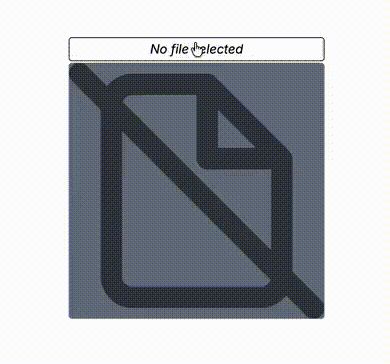

<style>
  pre.structure a[href] {
    text-decoration: underline;
  }
</style>

# @react-packages/file-upload
React component which extends HTML file input by adding a view for the uploaded file(s). The view
is to make sure that we're uploading the correct file(s). It supports view for image, video and
text file. For audio file, it will show the player so that you can hear the audio. Possibly, in the
next releases, we try to support the view of more file types.




### Basic usage
```typescript
import FileUpload from '@react-packages/file-upload';

...

<FileUpload name='uploadedFiles' multiple className='align-bottom' />
...
```
The above example shows how to use the component using the default options. You may apply the props
of HTML `input` element to `FileUpload` element, except `type` prop is always `"file"`.

### More options <a name="more_options"></a>
To change some options, we must use `createInput` function as the following example:
```typescript
import {createInput} from '@react-packages/file-upload';
const FileUpload = createInput({
    ...
});

...

<FileUpload name='uploadedFiles' multiple className='align-bottom' />
...
```
`createInput` function takes one parameter which is an object that is defined as follows:
```typescript
type Params = {
    ListPopup?: React.ComponentType<{
        files: File[],
        setViewIndex: (index: number) => void,
        setVisible: (visible: boolean) => void,
        viewIndex: number,
        visible?: boolean,
    }> | null,
    maxViewSize?: number,
    moreFile?: string | React.ComponentType<{count: number}> | null,
    noFileImage?: React.ReactNode,
    noFileName?: React.ReactNode,
    noViewImage?: React.ReactNode,
    ratioX?: number,
    ratioY?: number,
    styles?: {
        audio?: TStyle,
        bgView: TStyle,
        bgViewSingle?: TStyle,
        buttonMore: TStyle,
        buttonNav: TStyle,
        container: TStyle,
        containerView: TStyle,
        fileItem?: TStyle,
        fileItemViewed?: TStyle,
        fileItemText?: TStyle,
        fileList?: TStyle,
        fileListBackdrop?: TStyle,
        fileName: TStyle,
        fileNameSingle?: TStyle,
        image?: TStyle,
        input: TStyle,
        text?: TStyle,
        video?: TStyle,
        onLoad?: (styles: Omit<NonNullable<Params['styles']>, 'onLoad'>) => void,
    },
}
```
where `TStyle` is 
```typescript
{
    className?: string,
    style?: CSSProperties,
}
```

- `ListPopup` <a name="options-listpopup"></a>   
  If `multiple` prop is set then the user may select more than one file to upload. If the user
  selects more than one file, `ListPopup` defines the component to show the list of files which
  the user can choose another file to view. The component should render a popup. The component has
  the props:
  + `files` is an array of files that has been selected by the user to upload. Each item in the
    array is `File` object. It has `name` property which is the file name that should be displayed
    in the list. 
  + `setViewIndex` is a function that must be invoked when the user chooses a file to view. The
    function accepts the index number of file in `files` array as the parameter.
  + `setVisible` is a function to close the popup. The function must be invoked with the parameter
    `false`. In turn, it will set [`visible`](#options-ListPopup-visible) prop.
  + `viewIndex` is the index number of file in `files` array that is being viewed. There may be the
    different appearance style for the being viewed file in the list of file names.
  + `visible`<a name="options-ListPopup-visible"></a>  determines the visibility of the popup. If
    `true`, the component should render the list of files. Otherwise, it should not display
    anything.

  If `ListPopup` is set to be `null` then there will be no popup will be displayed. In this case,
  the user will depends on the navigation buttons beside the view area to show the view of the
  other files. If you decide to implement your own popup component,
  [`React.createPortal`](https://react.dev/reference/react-dom/createPortal) may be useful for you.

  *By default* (if you don't set `ListPopup`), it will be provided a simple popup to show list of
  files.

- `maxViewSize` <a name="options-maxviewsize"></a>   
  is the maximum size (in bytes) of file that can be viewed. If the size exceeds `maxViewSize`,
  [`noViewImage`](#options-noViewImage) will be displayed as the view, instead of the content of
  file.  
  *Default value*: 10 Mb

- `moreFile` <a name="options-morefile"></a>   
  Defines the content of popup button. If the user clicks the popup button, it will show the
  [popup](#options-ListPopup) containing the list of files. ***Note***, `moreFile` defines the
  **content** of the popup button, not the button itself. Please read 
  [The structure of elements](#the_structure_of_elements) section for more clear insight.

  `moreFile` can be set as a component or a string. If it's a component, it must have one required
  prop that is `count` prop. This prop value is the count of uploaded files. If `moreFile` is set
  as a string then the content of popup button is the string

    ``  `+${count - 1} ${moreFile}` ``

  The popup button won't be visible if the user only selects one file to upload. It's also
  invisible if we set `moreFile` to be `null`. For the last case, we should also set
  [`ListPopup`](#options-ListPopup) to be `null` because no way to show the popup. Also contraly,
  if `ListPopup` is `null` but `moreFile` is not `null`, the button won't work as expected because
  no popup shown when the button is clicked.

  *Default value*: string `"more"`

- `noFileImage` <a name="options-nofileimage"></a>   
  It will be displayed as a view if the user hasn't select yet any file to upload.  
  *Default value*: an `svg` element which depicts "no file" icon.

- `noFileName` <a name="options-nofilename"></a>   
  Defines what will be displayed if the user hasn't select any file on the place where the name of
  being viewed file is displayed. It's `ReactNode` type, so, you may set `null` or another empty
  value to display nothing. Please read [The structure of elements](#the_structure_of_elements)
  section for more clear insight.   
  *Default value*: `<i>No file selected</i>`

- `noViewImage` <a name="options-noviewimage"></a>   
  It will be displayed as the view if the file cannot be viewed. That is if it's not an audio,
  image, text or video file. If its size exceeds [`maxViewSize`](#options-maxViewSize), it also
  cannot be viewed.   
  *Default value*: an `svg` element depicts an icon.

- `ratioX` <a name="options-ratiox"></a>   
  Along with [`ratioY`](#options-ratioY), it determines the ratio between width and height of the
  view area.   
  *Default value*: 1

- `ratioY` <a name="options-ratioy"></a>   
  Along with [`ratioX`](#options-ratioX), it determines the ratio between height and width of the
  view area.   
  *Default value*: 1

- `styles` <a name="options-styles"></a>   
  It defines CSS styles for the elements rendered by `FileUpload` component. From the definition of
  `createInput` function parameter above, we can see that `styles` is an object containing some
  properties whose type of `TStyle`. Each of these properties is applied to the specific element in
  `FileUpload` component. To which element they are applied, it will be obvious if we also know the
  structure of element in the component. It's explained in
  [next section](#the_structure_of_elements).

  Here, we only explain the properties which are not depicted in the structure of elements.
  + `bgViewSingle` is applied to the element which applies `bgView` when there are only one
    uploaded file. It's merged with `bgView`.
  + `fileItemViewed` is applied to the element which applies `fileItem` when the file item is being
    viewed. It's merged with `fileItem`.
  + `fileNameSingle` is applied to the element which applies `fileName` when there are only one
    uploaded file. It's merged with `fileName`.
  + `onLoad` is a function that will be executed after the component is mounted. This function can
    make some adjustments to CSS style because of the differences among the browser versions and/or
    environtments. If there are some instances of `FileUpload` component, this function is will be
    executed only once for all instances, not executed for every instance.

### The structure of elements <a name="the_structure_of_elements"></a>
Below, the elements rendered by `FileUpload` component:
<pre class="structure">
  &lt;div className={props.className} style={ { display:'inline-block', width:'20rem', ...props.style} }&gt;
      &lt;div {...<a href="#options-styles">styles</a>.container}&gt;
          &lt;div {...<a href="#options-styles">styles</a>.containerView}&gt;
              &lt;button
                  {...<a href="#options-styles">styles</a>.buttonNav}
                  type='button'
              &gt;
                  &lt;span>&amp;lt;&lt;/span>
              &lt;/button>
              &lt;div {...<a href="#options-styles">styles</a>.bgView}>
                  &lt;<a href='https://atmulyana.github.io/react-packages/rect/'>Rect</a>
                    ratioX={<a href="#options-ratiox">ratioX</a>}
                    ratioY={<a href="#options-ratioy">ratioY</a>}
                  &gt;
                      &lt;Content file={files[viewIndex] || null} />
                  &lt;/<a href='https://atmulyana.github.io/react-packages/rect/'>Rect</a>&gt;
              &lt;/div>
             &lt;button
                  {...<a href="#options-styles">styles</a>.buttonNav}
                  type='button'
              &gt;
                  &lt;span>&amp;gt;&lt;/span>
              &lt;/button>
          &lt;/div>
          &lt;div {...<a href="#options-styles">styles</a>.input}>
              &lt;button
                  {...<a href="#options-styles">styles</a>.fileName}
                  type='button'
              &gt;
                  {files[viewIndex]?.name ?? <a href="#options-nofilename">noFileName</a>}
              &lt;/button>
              &lt;button 
                  {...<a href="#options-styles">styles</a>.buttonMore}
                  type='button'
              &gt;
                  &lt;<a href="#options-morefile">MoreFile</a> count={files.length} /&gt;
              &lt;/button>
          &lt;/div>
          &lt;input
              {...props}
              className={undefined}
              style={ {display: 'none'} }
              type='file'
          /&gt;
          &lt;<a href="#options-listpopup">ListPopup</a> .../&gt;
      &lt;/div>
  &lt;/div>
</pre>

The elements rendered by `Content` (see the code above) component will vary depending on the type
of file. The following list shows the file types and their representing elenent(s):
- ##### audio
  <pre class="structure">
  &lt;div {...<a href="#options-styles">styles</a>.audio}>
      &lt;audio autoPlay controls ... />
  &lt;/div>
  </pre>

- ##### image
  <pre class="structure">
  &lt;img {...<a href="#options-styles">styles</a>.image} ... />
  </pre>

- ##### text
  <pre class="structure">
  &lt;pre {...<a href="#options-styles">styles</a>.text}>{fileContent}&lt;/pre>
  </pre>

- ##### video
  <pre class="structure">
  &lt;video {...<a href="#options-styles">styles</a>.video} autoPlay ... />
  </pre>

- ##### the other types or file size greater than [`maxViewSize`](#options-maxviewsize)
  [`noViewImage`](#options-noviewimage)

- ##### no file has been selected to upload
  [`noFileImage`](#options-nofileimage)


If you don't set [`ListPopup`](#options-listpopup), there is a simple propup available for you. The
popup has structure of elements:
<pre class="structure">
&lt;div popover='auto' style={ {
    backgroundColor: 'transparent',
    display: 'fixed',
    height: '100%',
    left: 0,
    top: 0,
    width: '100%',
} }>
    &lt;div {...<a href="#options-styles">styles</a>.fileListBackdrop}>&lt;/div>
    &lt;div style={ {
        alignItems: 'center',
        backgroundColor: 'transparent',
        bottom: 0,
        display: 'flex',
        justifyContent: 'center',
        left: 0,
        overflow: 'auto',
        position: 'absolute',
        right: 0,
        top: 0,
    } }&gt;
        &lt;ul {...<a href="#options-styles">styles</a>.fileList}>
           &lt;li key={0} {...<a href="#options-styles">styles</a>.fileItem}>
                &lt;span {...<a href="#options-styles">styles</a>.fileItemText}>{file0.name}&lt;/span>
            &lt;/li>
            &lt;li key={1} {...<a href="#options-styles">styles</a>.fileItem}>
                &lt;span {...<a href="#options-styles">styles</a>.fileItemText}>{file1.name}&lt;/span>
            &lt;/li>
            ...
        &lt;/ul>
    &lt;/div>
&lt;/div>
</pre>


### CSS tricks <a name="css_tricks"></a>

#### Altering CSS `width` and `display` of the `FileUpload` input
From [the structure of elements](#the_structure_of_elements), we can see that `className` and
`style` prop are applied to the top `div` element. However, this element has two default CSS
property values, those are:
```
display: inline-block;
width: 20rem;
```
These default CSS properties are set via `style` prop. Therefore, if you want to override the
default value(s), you should set it via `style` prop. But, if you insists to utilize `className`
prop, you must use `!important` flag after the value in your CSS class rule defition. For example,
if you use Tailwind CSS and want to set `width` to be `16rem` then you must use CSS class `!w-3xs`,
instead of `w-3xs`.

To set `width` greater than `20rem`, you must also set [`styles`](#options-styles)`.container`
because its default `max-width` is `20rem`.

### Altering the content of navigation buttons
There are two navigation buttons beside the view area. These buttons are visible if there are more
one uploded file. The buttons are to change the view to another file. Remember, only one file on
the view at one time.

The content of the left navigation button is `<` character and the right one contains `>`. If you
want to change these contents, you must do it by CSS. There is a CSS property called `content` that
you can use for this purpose.

Firstly, you must use [`createInput`](#more_options) function to set the CSS class name for the
navigation button. For example, we use class name `file-upload-btn-nav`
```typescript
const FileUpload = createInput({
    ...
    styles: {
        buttonNav: {
            className: 'file-upload-btn-nav',
        },
        ...
    }
});
```
Then, declare some CSS rules as follows (you may use `<style>` tag or create a separate CSS file):
```css
/* Common style for navigation buttons */
.file-upload-btn-nav {
    align-items: center;
    background-color: black;
    border-radius: 0.25rem;
    box-sizing: border-box;
    color: white;
    cursor: pointer;
    display: flex;
    flex: none;
    font-size: 1.25rem;
    font-weight: bold;
    height: 1.5rem;
    justify-content: center;
    opacity: 0.3;
    width: 2rem;
    z-index: 1;
}
.file-upload-view:hover .file-upload-btn-nav {
    opacity: 1;
}

/* Hide the default content of navigation buttons */
.file-upload-btn-nav span {
    display: none;
}

/* The content of left navigation button */
.file-upload-btn-nav:first-child::before {
    content: "«";
}

/* The content of right navigation button */
.file-upload-btn-nav:last-child::before {
    content: "»";
}

/**
 * Hide the navigation buttons when:
 * - Left button: the first file is being viewed
 * - Right button: the last file is being viewed
 * - Both buttons: the input is disabled (`disabled` prop is set)
 */
.file-upload-btn-nav:disabled {
    visibility: hidden;
}
```
`:first-child` selector refers to the element which is the first child of its parent. The left
navigation button meets this condition. Similarly, `:last-child` will match the right navigation
button. The combination of `::before` selector and `content` property will insert a new content
before the actual content. Because the actual content is hidden by the third rule, we will only see
the new content.
> CSS `content` property can also display an image. Please consult the further information
> [here](https://developer.mozilla.org/en-US/docs/Web/CSS/Reference/Properties/content).

Notice the last rule, we use `:disabled` selector. This selector will apply to the disabled form
elements. The navigation buttons are `button` element and it's a form element. The left button will
be disabled when the first uploaded file is being viewed because there is no previous file in the
list. Whereas, the right button is disabled when the last uploaded file is being viewed.