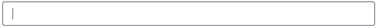

# @react-packages/keywords
It's React component to input some keywords for database indexing or the metadata of search engine.
It has the interface to add or delete a keyword easily. The following animated image depicts how
the component works.



After you type a keyword then you type a separator character, such as comma, the keyword will be
visually enclosed by a box and the separator itself is not displayed. You can delete a keyword by
clicking "`x`" mark on the right of the keyword or you can press <kbd>Del</kbd> or <kbd>Backspace</kbd>
key on keyboard when the keyword you want to delete has focus. You can move focus among keywords by
pressing arrow keys (or other ones defined by option). Beside that, <kbd>Home</kbd> key is to set
focus on the first keyword and <kbd>End</kbd> is for the last one.

## Basic Usage
```javascript
import React from 'react';
import Keywords from "@react-packages/keywords";

export default function KeywordsDemo() {
    return <form ...>
        <div className='mb-4'>
            <label className='block'>Keywords</label>
            <Keywords name='keywords' />
        </div>
        <button>Submit</button>
    </form>;
}
```
On server, if HTTP parameters are collected using `FormData` object, the statement
`formData.getAll("keywords")` will return the array of inputed keywords.

## More Options (using `createInput` function)
`Keywords` component exemplified  in the previous section uses the default options and CSS. If you
want some customizations, you must use `createInput` function.

`createInput` function takes one parameter which is an object that its properties are the settings
for `Keywords` component. This function will return a component object which can be used as an
element (used in JSX).

The setting object has the following properties (all properties are optional):
- `buzzedDuration`<a name="#options-buzzedDuration"></a>  
  When a user types a keyword that already exists in the list, the keyword won't be added into the
  list (no duplicate keyword). Instead, the same keyword in the list is highligted at certain
  duration. `buzzedDuration` determines how long the keyword is highlighted in milliseconds. If you
  want no highlight, set this property to `0` or negative value. You may also need to define
  `styles.buzzedItemBox` to set CSS style how the duplicate keyword is highlighted.  
  *Default value*: `1500`

- `Input`<a name="#options-Input"></a>  
  is a component function/class which renders an input element. If `Keywords` element is placed
  inside a `form` element, the value of this input will be submitted if the form is submitted. This
  element should be invisible (you may use CSS).
  
  The input component must have `name` and `value` prop. `value` is an array of string. For example,
  if you want the keywords are submitted as a single value (all keywords are concatenated with
  separated by comma):
  ```javascript
  function({name, value}) {
    return <input type='hidden' name={name} value={value?.join(',')} />
  }
  ```
  If you want no input element, set `Input` to `null`.
  
  *Default value*:
  ```javascript
  function({name, value}) {
    return <select
        multiple
        name={name}
        onChange={noop}
        style={{display: 'none'}}
        value={value}
    >
        {value?.map(word => <option key={word} value={word} />)}
    </select>
  }
  ```

- `invalidChars`   
  is a regular expression of all invalid characters that cannot exist in a keyword. If a user types
  an invalid character, the character will not displayed. If the user uses keyboard, mostly, this
  regular expression is tested againts one character when every time a user press a character on
  keyboard.  If the user uses an IME (Input Method Editor), there may be more than one character to
  test by this regular expression. If one of these characters is invalid then all these characters
  are considered as invalid.  
  *Default value*: `/[^\p{L}\p{Number}'-]/u` (other than letter, number, single quotes and dash)

- `nextKeys`  
  is a string array containing the keys (see
  [list of keys](https://developer.mozilla.org/en-US/docs/Web/API/UI_Events/Keyboard_event_key_values))
  to move the focus to next keyword, after the keyword which currently has focus. If which has
  focus is the last keyword, these keys will nove focus to the text input (where the user types a
  new keyword).  
  *Default value*: `['ArrowRight', 'Right']`

- `prevKeys`  
  is a string array containing the keys (see
  [list of keys](https://developer.mozilla.org/en-US/docs/Web/API/UI_Events/Keyboard_event_key_values))
  to move the focus to previous keyword, before the keyword which currently has focus. If which has
  focus is the text input (where the user types a new keyword), these keys will nove focus to the
  last keyword. If you set left arrow for `prevKeys` (default) and the text input has focus, the
  focus will move to the last keyword if the cursor position is before the first character in the
  text input. It's because, for the text input, the left arrow is to move cursor.   
  *Default value*: `['ArrowLeft', 'Left']`

- `separators`  
  is a regular expression of all separator characters. If the user types one of these characters,
  the word typed before will be added as a new keyword and the user is ready to type a new keyword.
  The separator won't be displayed. This regular expression will be tested againts a single
  character. Therefore, you don't need pattern like `$` to assert that the separator character must
  be at the end of string.  
  *Default value*: `/[ ,;]/` (space, comma or semicolon)

- `styles`  
  Using `styles`, you can customize CSS (the appearance) of `Keywords` element. `styles` is an
  object which its each property defines CSS for a paticular element in `Keywords` component. The
  object properties are:
  ```javascript
  {
    buzzedItemBox?: TStyle,
    close: TStyle,
    container: TStyle,
    highlightItemBox?: TStyle,
    inputText: TStyle,
    itemsBox: TStyle,
    word?: TStyle,
  }
  ```
  where
  ```javascript
  type TStyle = {
    className?: string,
    style?: CSSProperties,
  }
  ```

  To explain to which element each property is applied, you must know HTML structure of `Keywords`
  component. We will describe the use of each property by exposing the structure of elements and
  place each property at the corresponding element. `Keywords` component consists of the following
  elements:
  ```xml
  <div ...>
      <div {...styles.container} ...>
          <Item word={keyword1} ... />
          <Item word={keyword2} ... />
          <Item word={keyword3} ... />
          ...

          <input {...styles.inputText} type='text' ... />
      </div>
      <Input name={name} value={values} ... />
  </div>
  ```
  where `Item` element consists of the following elements:
  ```xml
  <div {...styles.itemsBox} ...>
      <span {...styles.word}>{word}</span>
      <a {...styles.close} href='#' ...>x</a>
  </div>
  ```
  `buzzedItemBox` and `highlightItemBox` are applied to the element which applies `itemsBox`. They
  are merged with `itemsBox`. `highlightItemBox` is applied when the keyword has focus.
  `buzzedItemBox` is applied when a duplicate keyword is typed (see
  [`buzzedDuration`](#options-buzzedDuration) option).

  The component yielded by `createInput` function has also `className` and `style` prop. These
  props are applied to most-outer `div` element.  
  *Default value*:
  ```javascript
  {
    buzzedItemBox: {
        style: {
            borderColor: '#c27803',
            borderWidth: '4px',
            margin: '-2px',
            zIndex: 100,
        },
    },
    close: {
        style: {
            fontWeight: '800',
            marginLeft: '.375rem',
            outlineStyle: 'none',
            outlineWidth: '0px',
            textDecoration: 'none !important',
        },
    },
    container: {
        style: {
            backgroundClip: 'border-box',
            backgroundColor: 'white',
            borderColor: '#475569',
            borderRadius: '.25rem',
            borderStyle: 'solid',
            borderWidth: '1px',
            color: '#475569',
            display: 'flex',
            flexWrap: 'wrap',
            fontSize: '1rem',
            gap: '.25rem',
            height: 'auto !important',
            lineHeight: 1.5,
            paddingBlock: '.375rem',
            paddingInline: '.75rem',
            width: '100%',
        },
    },
    itemsBox: {
        style: {
            backgroundColor: '#E5E7EB',
            borderColor: '#E5E7EB',
            borderRadius: '.25rem', 
            borderStyle: 'solid',
            borderWidth: '2px',
            display: 'flex',
            flex: 'none',
            height: 'auto',
            lineHeight: 1,
            paddingBlock: '.125rem',
            paddingInline: '.25rem',
        },
    },
    highlightItemBox: {
        style: {
            borderColor: '#3F83F8',
        },
    },
    inputText: {
        style: {
            backgroundClip: 'border-box',
            backgroundColor: 'transparent',
            borderColor: 'transparent',
            borderStyle: 'solid',
            borderWidth: '2px',
            display: 'block',
            flex: 1,
            height: 'auto',
            lineHeight: 1,
            minWidth: '2.25rem',
            outlineStyle: 'none',
            outlineWidth: '0px',
            padding: '.125rem'
        },
    },
    word: {
        style: {
            cursor: 'default',
        },
    }
  }
  ```

  For example, the following code creates `Keywords` component which uses Tailwind CSS:
  ```javascript
  import React from 'react';
  import {createInput} from "@react-packages/keywords";
  const Keywords = createInput({
      styles: {
          buzzedItemBox: {
              className: 'animate-ping !border-yellow-500',
          },
          close: {
              className: 'ml-1.5 font-extrabold outline-0 !no-underline',
          },
          container: {
              className: `flex flex-wrap gap-1 w-full h-auto py-1.5 px-3 text-base
              border border-solid rounded-sm border-gray-600 dark:border-gray-400
              bg-clip-border bg-white dark:bg-black text-gray-600 dark:text-gray-400`,
          },
          itemsBox: {
              className: `flex flex-none border-solid border-2 border-gray-200 dark:border-gray-800 rounded-sm
              bg-gray-200 dark:bg-gray-800 has-focus:border-blue-500 px-1 py-0.5 h-auto leading-none cursor-default`,
          },
          inputText: {
              className: `block flex-1 border-solid border-2 border-transparent rounded-sm bg-transparent
              outline-0 outline-none leading-none bg-transparent bg-clip-border h-auto p-0.5 min-w-9`,
          },
          word: {
              className: 'cursor-default',
          }
      }
  });

  export default function KeywordsDemo() {
      return <form
          className='p-4'
          ...
      >
          ...
          <div className='mb-4'>
              <label className='block'>Keywords</label>
              <Keywords />
          </div>
          <button className='bg-blue-500 text-white'>Submit</button>
      </form>;
  }
  ```

## `Keywords` Component Props
All props are optional.

- `className`  
  It's a string containing CSS class names separated by space. It will applied to the most-outer
  `div` element which contructs `Keywords` component.

- `name`  
  As the other HTML form inputs, it's the name for the input. This name will be submitted to the
  server as HTTP parameter name. You must also set [`Input`](#options-Input) option correctly.

- `onChange`  
  It's the function whose type of `(newKeywords: string[]) => any`. This function is invoked
  whenever the user adds or deletes a keyword.

- `style`  
  It has type of `CSSProperties`. It's inline CSS that will be applied to the most-outer `div`
  element which contructs `Keywords` component.

- `value`  
  It's an array of string containing keywords that will be displayed in `Keywords` component. In
  other words, it chnages the keywords by code, not by the user input action. After `value` is set,
  the user can still add/delete a keyword. So, setting this prop doesn't make the keywords
  displayed sticks to `value` prop. But, when `value` changes, the keywords displayed will be the
  same as noted by `value` prop.