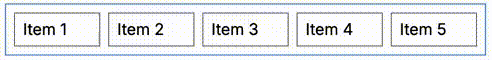
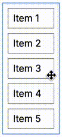

# @react-packages/sortable-list
React component that can rearrange an item position in the list by dragging it to the expected
position (can change the order of items). Two animated images below depict how this component works.





## Usage
To use this component is very simple. You only need to wrap the item elements that you want to sort
with `SortableList` element as the following example:
```javascript
import React from 'react';
import SortableList from '@react-packages/sortable-list';

export default function SortableListDemo() {
    return <div className='flex flex-col border border-blue-500 w-24 p-2 gap-2'>
    <SortableList>
        <span className='items-stretch border border-gray-500 px-2 py-1'>
            Item 1
        </span>,
        <span className='items-stretch border border-gray-500 px-2 py-1'>
            Item 2
        </span>,
        <span className='items-stretch border border-gray-500 px-2 py-1'>
            Item 3
        </span>,
        <span className='items-stretch border border-gray-500 px-2 py-1'>
            Item 4
        </span>,
        <span className='items-stretch border border-gray-500 px-2 py-1'>
            Item 5
        </span>
    </SortableList>
    </div>
}
```

`SortableList` component doesn't insert a container element to wrap the item elements. Therefore,
from above example, all `span` elements are direct children of `div` element. Because of this, you
can set CSS of those elements as if no `SortableList` element.

> Actually, `SorttableList` component inserts two hidden *item* elements which take no space. They
> are needed to get the reference of all item elements and set the needed event handlers.

### Using *state* variable to make the order of items persistent
If we use the example above, the order of items will be reverted to the beginning order when the
component is re-rendered. To make the order persistent, we must use a *state* variable as the
following example:
```typescript
import React from 'react';
import SortableList, {type SortableChildren} from '@react-packages/sortable-list';

export default function SortableListDemo() {
    const [itemELms, setItemElms] = React.useState<SortableChildren>([
        <span className='items-stretch border border-gray-500 px-2 py-1'>
            Item 1
        </span>,
        <span className='items-stretch border border-gray-500 px-2 py-1'>
            Item 2
        </span>,
        <span className='items-stretch border border-gray-500 px-2 py-1'>
            Item 3
        </span>,
        <span className='items-stretch border border-gray-500 px-2 py-1'>
            Item 4
        </span>,
        <span className='items-stretch border border-gray-500 px-2 py-1'>
            Item 5
        </span>
    ]);

    return <div className='flex flex-col border border-blue-500 w-24 p-2 gap-2'>
        <SortableList onOrderChange={elms => setItemElms(elms)}>
            {itemELms}
        </SortableList>
    </div>;
}
```

### How to save the new order of items into database
Usually, the purpose of using this component is we want to re-order the items in the list and save
the new order into database. Now, how to read the new order of items? In DOM API, there is
`querySelectorAll` function that can read the latest HTML structure that has dynamically changed.
Need to remember, `SortableList` changes HTML structure.

> The *state* variable in the example above, contains `React.ReactElement` object. It's hard to
> read.

To read the order of items, each item element must contain a unique ID. `querySelectorAll` function
will read these IDs in the order as the same as the order of item elements at that moment. Every
time we change the order of item elements by dragging them, `querySelectorAll` will read the
elements in the up-to-date order.

For example, we change the example above by putting a hidden input inside each item element which
holds the item ID. "Save Order" button reads the current order and save it to database.
```typescript
import React from 'react';
import SortableList, {type SortableChildren} from '@react-packages/sortable-list';
import {saveOrder} from './db/menu-order';

export default function SortableListDemo() {
    const [itemELms, setItemElms] = React.useState<SortableChildren>([
        <span className='items-stretch border border-gray-500 px-2 py-1'>
            <input type='hidden' name="id" value="1" />
            Item 1
        </span>,
        <span className='items-stretch border border-gray-500 px-2 py-1'>
            <input type='hidden' name="id" value="2" />
            Item 2
        </span>,
        <span className='items-stretch border border-gray-500 px-2 py-1'>
            <input type='hidden' name="id" value="3" />
            Item 3
        </span>,
        <span className='items-stretch border border-gray-500 px-2 py-1'>
            <input type='hidden' name="id" value="4" />
            Item 4
        </span>,
        <span className='items-stretch border border-gray-500 px-2 py-1'>
            <input type='hidden' name="id" value="5" />
            Item 5
        </span>
    ]);

    return <div> 
        <div id="list2" className='flex flex-col border border-blue-500 w-24 p-2 gap-2'>
            <SortableList onOrderChange={elms => setItemElms(elms)}>
                {itemELms}
            </SortableList>
        </div>
        <div className="mt-1">
            <button
                className='cursor-pointer font-bold'
                type='button'
                onClick={() => {
                    const list = document.getElementById('list2') as HTMLDivElement;
                    const ids: string[] = [];
                    const inputs = list.querySelectorAll('input[name=id]');
                    for (let inp of inputs) {
                        ids.push((inp as HTMLInputElement).value);
                    }
                    saveOrder(ids).then(resp => {
                        //Place the code for success process
                    }).catch(() => {
                        //Place the code for failed process
                    });
                }}
            >Save Order</button>
        </div>
    </div>;
}
```

### Mouse cursor
`SortableList` changes the mouse cursor style of item element to be "move" cursor. If you want
another cursor, define a CSS class which declares `cursor` property with `!important` rule and then
apply this CSS class to the item element. For example, if you want the default cursor and you use
Tailwind CSS then you must use <nobr>`!cursor-default`</nobr> class.
```html
<span className='flex-1 border border-gray-500 px-2 py-1 !cursor-default'>
    <input type='hidden' name="id" value="3" />
    Item 3
</span>
```

## `SortableList` component prop
- `onOrderChange`  
  is a function whode type of `(items: SortableChildren) => any`. This function is invoked every
  time the order of item elements changes. The example of the use of this function, you can see in
  the second example above. This prop is optional.